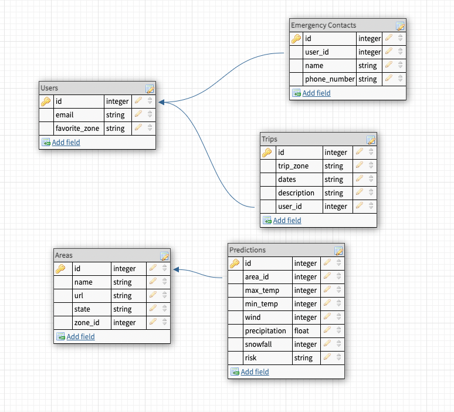
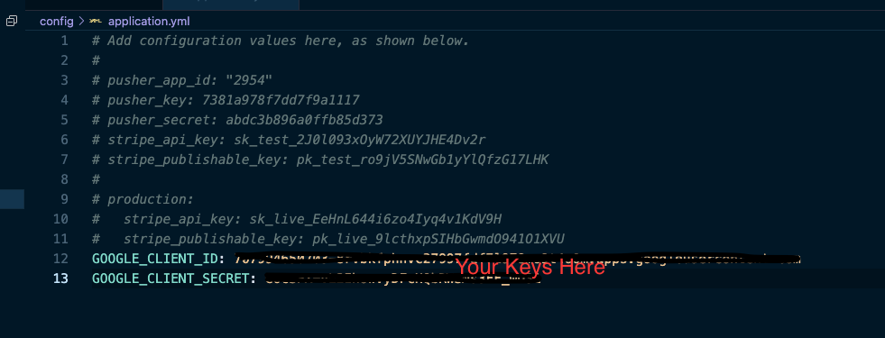

<!-- Improved compatibility of back to top link: See: https://github.com/othneildrew/Best-README-Template/pull/73 -->

<!--
*** Thanks for checking out the Best-README-Template. If you have a suggestion
*** that would make this better, please fork the repo and create a pull request
*** or simply open an issue with the tag "enhancement".
*** Don't forget to give the project a star!
*** Thanks again! Now go create something AMAZING! :D
-->

<!-- PROJECT SHIELDS -->
<!--
*** I'm using markdown "reference style" links for readability.
*** Reference links are enclosed in brackets [ ] instead of parentheses ( ).
*** See the bottom of this document for the declaration of the reference variables
*** for contributors-url, forks-url, etc. This is an optional, concise syntax you may use.
*** https://www.markdownguide.org/basic-syntax/#reference-style-links
-->

<!-- PROJECT LOGO -->
 

  

<h1 align="center"><strong>Flakes of Wrath</strong></h1>

  

    <h2> Plan winter trips into the backcountry with smart forecasts and a proprietary avalanche prediction algorithm.  </h2>
     
    <a href="https://flakes-of-wrath.fly.dev"><strong>See it live</strong></a>
     
     
    <a href="https://github.com/Avalanche-Safety-People/flakes_of_wrath_fe/issues">Report Bug</a>
    ·
    <a href="https://github.com/Avalanche-Safety-People/flakes_of_wrath_fe/issues">Request Feature</a>
  

 

### Built with:

[![Contributors][contributors-shield]][contributors-url]
[![Forks][forks-shield]][forks-url]
[![Issues][issues-shield]][issues-url]

<!-- TABLE OF CONTENTS -->

### About The Project

  <h1>
Table of Contents
</h1>
  <ol>
    <li>
      <a href="#about-the-project">About The Project</a>
        <li><a href="#built-with">Built With</a></li>
    </li>
    <li>
      <a href="#getting-started">Getting Started</a>
        <li><a href="#prerequisites">Prerequisites</a></li>
    </li>
    <li><a href="#contact">Contact</a></li>
    <li><a href="#acknowledgments">Acknowledgments</a></li>
  </ol>

<!-- ABOUT THE PROJECT -->

Database tables are stored on the back end of the app, but to make sure you can see how the info relates here is a visualization of the tables

(<a href="#readme-top">back to top</a>)

<!-- GETTING STARTED -->

## Prerequisites

This project requires Ruby 2.7.4
- must use Rails 5.2.x
- must use PostgreSQL

 

## Setup/Install
* Fork this repository
* Clone your fork
* From the command line, install gems and set up your DB:
    * `bundle`
* APIs used
  * Please follow the link to get your `client id` and `client secret` used later https://developers.google.com/identity/protocols/oauth2
  * `bundle exec figaro install`
    * go to `config/application.yml`
    * name your API key from open weather `GOOGLE_CLIENT_ID` and `GOOGLE_CLIENT_SECRET`

* Run `rails db:{create,migrate}`
* Run the test suite with `bundle exec rspec`.
* To see the app in production go to [Flakes of Wrath](https://flakes-of-wrath.fly.dev) on Fly.io

<!-- CONTACT -->
## Contact

Individual contributors :
* [Gavin Carew](https://github.com/gjcarew)
* [Kaelin Sleevi](https://github.com/KaelinSleevi)
* [Jake Kim](https://github.com/LlamaBack)
* [Noah van Ekdom](https://github.com/noahvanekdo)
* [Ryan Smith](https://github.com/RyanChrisSmith)

(<a href="#readme-top">back to top</a>)

<!-- ACKNOWLEDGMENTS -->
## Acknowledgments

We are immensely grateful to the US Forest Service, Northwest Avalanche Center and the  National Avalanche Center. None of this would be possible without the work of hundreds of individual forecasters and field observers taking snowpack measurements throughout the united states. 

(<a href="#readme-top">back to top</a>)

<!-- MARKDOWN LINKS & IMAGES -->
<!-- https://www.markdownguide.org/basic-syntax/#reference-style-links -->
[contributors-shield]: https://img.shields.io/github/contributors/Avalanche-Safety-People/flakes_of_wrath_fe.svg?style=for-the-badge
[contributors-url]: https://github.com/Avalanche-Safety-People/flakes_of_wrath_fe/graphs/contributors
[forks-shield]: https://img.shields.io/github/forks/Avalanche-Safety-People/flakes_of_wrath_fe.svg?style=for-the-badge
[forks-url]: https://github.com/Avalanche-Safety-People/flakes_of_wrath_fe/network/members
[issues-shield]: https://img.shields.io/github/issues/Avalanche-Safety-People/flakes_of_wrath_fe.svg?style=for-the-badge
[issues-url]: https://github.com/Avalanche-Safety-People/flakes_of_wrath_fe/issues
[linkedin-shield]: https://img.shields.io/badge/-LinkedIn-black.svg?style=for-the-badge&logo=linkedin&colorB=555
[linkedin-url]: https://linkedin.com/in/linkedin_username
[product-screenshot]: images/screenshot.png
[Bootstrap.com]: https://img.shields.io/badge/Bootstrap-563D7C?style=for-the-badge&logo=bootstrap&logoColor=white
[Bootstrap-url]: https://getbootstrap.com
[Tailwind.com]: https://tailwindcss.com/
[Tailwind-url]: https://raw.githubusercontent.com/tailwindlabs/tailwindcss/HEAD/.github/logo-light.svg
